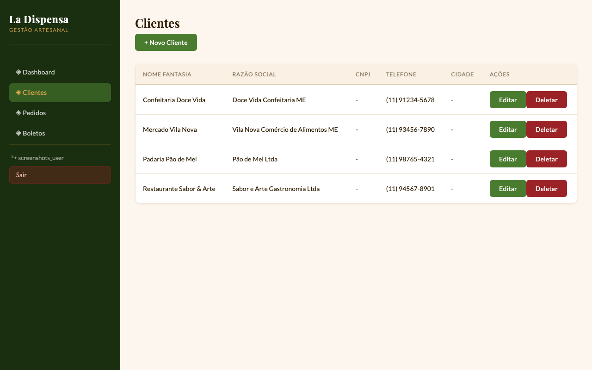
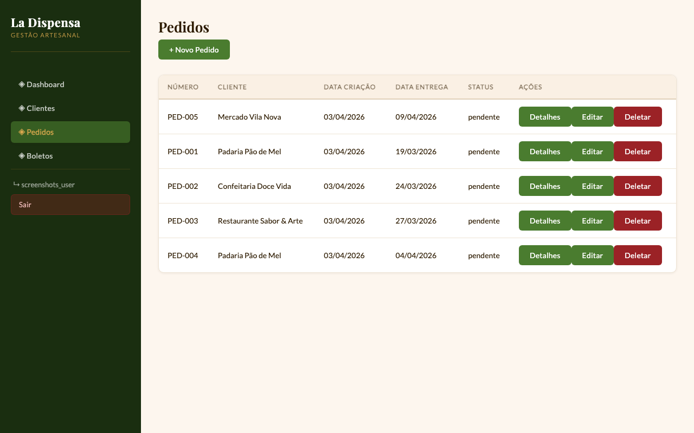
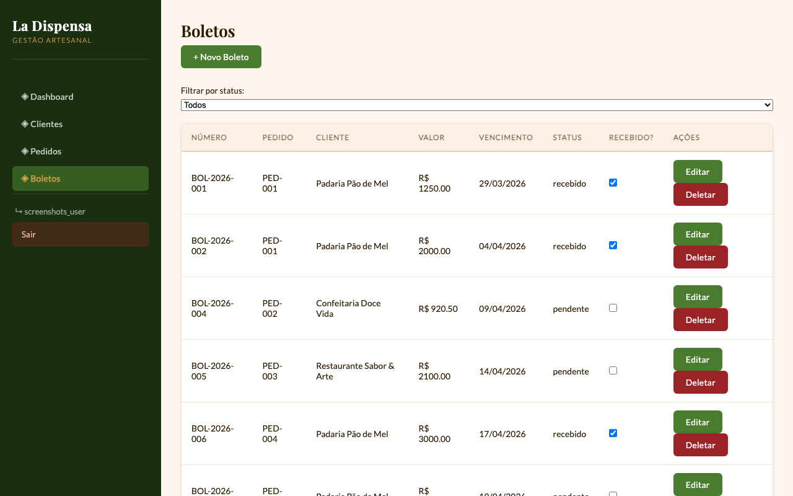
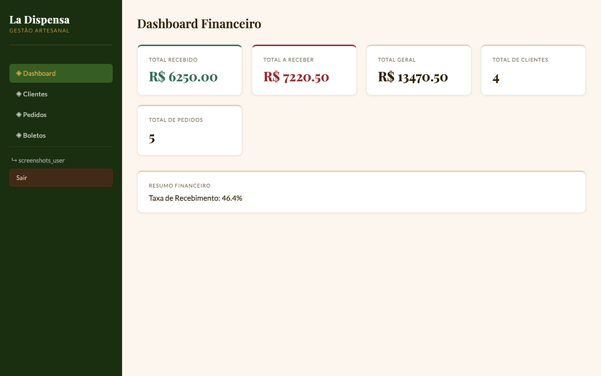

# La Dispensa - Sistema de Gestão Artesanal 🏢

> _Um ERP simples, intuitivo e acessível para pequenas empresas, freelancers e negócios em crescimento._

---

## 📑 Índice Rápido

Escolha abaixo onde você quer ir:

- **[👥 Para Usuários Finais](#seção-1--sobre-o-projeto-)** – Descubra o que o La Dispensa faz e como pode ajudar seu negócio
- **[⚛️ Para Desenvolvedores Frontend](#seção-2--frontend-tecnologia--implementação-)** – Entenda como o frontend foi construído (React, Vite, Axios)
- **[🛠️ Para Desenvolvedores Backend](#seção-3--backend-arquitetura--implementação-)** – Explore a arquitetura, banco de dados e APIs (Express, SQLite, JWT)

---

## SEÇÃO 1 – Sobre o Projeto 👥

### O que é o La Dispensa?

**La Dispensa** é um sistema web de gestão empresarial criado para resolver um problema real: **pequenas empresas controlando seu negócio em planilhas, cadernos e cacos de papel.**

Quantas vezes você:
- Perdeu uma nota com dados de um cliente?
- Não sabia quanto tinha a receber?
- Esqueceu o prazo de um pagamento?
- Duvidava se um pedido já tinha sido entregue?

O La Dispensa centraliza **tudo em um único lugar**: clientes, pedidos, produtos, cobranças e documentos fiscais. Tudo acessível de um computador, tablet ou celular.

#### Para Quem é?

✅ **Pequenas empresas** (1-50 pessoas) que crescem e precisam organizar a gestão  
✅ **Freelancers e prestadores de serviço** que precisam controlar clientes e pagamentos  
✅ **Negócios em startup** que querem começar simples e escalar depois  
✅ **Estudantes de programação** aprendendo como um projeto real é estruturado  

---

### Funcionalidades Principais

#### 🧑‍💼 Gestão de Clientes
**Organize seus relacionamentos comerciais**

Cadastre clientes com todos os dados relevantes. Veja o histórico de pedidos, pagamentos e interações tudo em um lugar. Nunca mais perca informações de contato ou confunda detalhes de um cliente.


_Gerência de clientes com visão centralizada de todos os contatos do seu negócio._

#### 📦 Gestão de Pedidos
**Acompanhe cada pedido desde a criação até a entrega**

Crie pedidos vinculados aos clientes, adicione produtos, estabeleça datas de emissão e entrega. Mantenha controle total do ciclo de vida de cada pedido.


_Lista completa de pedidos com status e detalhes._

#### 💰 Gestão de Boletos
**Rastreie suas cobranças e recebimentos**

Registre todos os boletos, acompanhe vencimentos, marque como recebido. Veja rapidamente quanto você já recebeu e quanto ainda falta receber.


_Resumo de boletos com filtro por status (recebido/a receber)._

#### 📄 Notas Fiscais
**Organize seus documentos fiscais em um só lugar**

Upload simples de PDFs de notas fiscais. Mantenha tudo organizado e fácil de encontrar quando precisar.

#### 📊 Dashboard Financeiro
**Veja o resumo do seu negócio em segundos**

KPIs principais no topo: total recebido, total a receber, total geral, quantidade de clientes e pedidos. Uma visão rápida de como está o negócio.


_Dashboard financeiro com resumo executivo._

---

### Fluxo de Uso – Passo a Passo

Usar o La Dispensa é simples assim:

1. **Crie uma Conta** → Faça seu login e configure seu workspace
2. **Cadastre Clientes** → Adicione informações dos seus clientes (nome, email, telefone, endereço)
3. **Crie Pedidos** → Novo pedido → escolha o cliente → defina data de emissão e entrega
4. **Adicione Produtos/Itens** → Para cada pedido, indique os produtos, quantidade e valor
5. **Registre Cobranças** → Crie boletos para o pedido com data de vencimento
6. **Acompanhe Pagamentos** → Marque os boletos como recebidos conforme os clientes pagam
7. **Visualize o Dashboard** → Veja em tempo real quanto já entrou de dinheiro

**Simples assim!** Nenhuma complexidade desnecessária.

---

### Benefícios

| Benefício | Descrição |
|-----------|-----------|
| 🏢 **Organização Centralizada** | Todos os dados do negócio em um único lugar |
| 📈 **Controle Financeiro** | Saiba exatamente quanto tem a receber e quanto já recebeu |
| 🔒 **Seguro e Confiável** | Autenticação JWT, dados persistidos em banco de dados |
| 📱 **Acessível em Qualquer Lugar** | Web app funciona em desktop, tablet e celular |
| ⚡ **Rápido e Responsivo** | Interface fluida, sem esperas, sem lentidão |
| 📊 **Escalável** | Comece simples, cresça conforme sua necessidade |
| 💰 **Gratuito e Aberto** | Código aberto, sem custos de licença |

---

## SEÇÃO 2 – Frontend: Tecnologia & Implementação ⚛️

### Por que React + Vite?

Escolhemos essa stack por uma razão simples: **velocidade + qualidade + comunidade ativa.**

- **React** → Componentes reutilizáveis, estado gerenciável, enorme comunidade
- **Vite** → Servidor de dev MUITO rápido, build otimizado, HMR instantâneo

### Tech Stack Frontend

| Tecnologia | Versão | Por que foi escolhida |
|-----------|--------|----------------------|
| **React** | 18.2.0 | Framework principal para UI componentizada |
| **Vite** | 4.5.14 | Build tool ultra-rápido e dev server instantâneo |
| **Axios** | 1.3.4 | HTTP client simples e robusto para chamar API |
| **Vitest** | 4.1.2 | Testes unitários rápidos, integração perfeita com Vite |
| **Playwright** | 1.59.1 | Testes end-to-end para validar fluxos críticos |

### Estrutura do Projeto Frontend

```
frontend/
├── src/
│   ├── components/          # Componentes reutilizáveis
│   │   ├── Navbar.jsx       # Barra de navegação
│   │   └── ...              # Outros componentes
│   │
│   ├── pages/               # Páginas principais (roteamento)
│   │   ├── Login.jsx        # Página de login
│   │   ├── Home.jsx         # Dashboard
│   │   ├── Clientes.jsx     # Gestão de clientes
│   │   ├── Pedidos.jsx      # Gestão de pedidos
│   │   ├── Boletos.jsx      # Gestão de boletos
│   │   └── ...
│   │
│   ├── services/            # Chamadas à API (Axios)
│   │   ├── api.js           # Configuração Axios + interceptors
│   │   ├── clientesAPI.js   # Endpoints /api/clientes
│   │   ├── pedidosAPI.js    # Endpoints /api/pedidos
│   │   └── ...
│   │
│   ├── context/             # Context API para estado global
│   │   └── AuthContext.jsx  # Contexto de autenticação
│   │
│   ├── styles/              # CSS global e de páginas
│   ├── App.jsx              # Componente raiz
│   └── main.jsx             # Entrada da aplicação
│
├── public/
├── vite.config.js           # Configuração Vite
├── vitest.config.js         # Configuração Vitest
├── package.json
└── index.html               # HTML principal (SPA)
```

### Padrões de Implementação

#### 1. **Component-Based Architecture**
Cada página/funcionalidade é um componente React com estado local (`useState`) e efeitos (`useEffect`).

```jsx
function Clientes() {
  const [clientes, setClientes] = useState([]);
  const [loading, setLoading] = useState(true);

  useEffect(() => {
    clientesAPI.getAll()
      .then(res => setClientes(res.data))
      .finally(() => setLoading(false));
  }, []);

  return (
    <div>
      {loading ? <p>Carregando...</p> : <ClientesList clientes={clientes} />}
    </div>
  );
}
```

#### 2. **Service Layer para API**
Todas as chamadas HTTP são centralizadas em `src/services/api.js`:

```jsx
// services/api.js
const api = axios.create({
  baseURL: 'http://localhost:5001/api'
});

// Interceptor: adiciona JWT em toda requisição
api.interceptors.request.use(config => {
  const token = localStorage.getItem('authToken');
  if (token) {
    config.headers.Authorization = `Bearer ${token}`;
  }
  return config;
});

// Exemplo: clientesAPI
export const clientesAPI = {
  getAll: () => api.get('/clientes'),
  getById: (id) => api.get(`/clientes/${id}`),
  create: (data) => api.post('/clientes', data),
  update: (id, data) => api.put(`/clientes/${id}`, data),
  delete: (id) => api.delete(`/clientes/${id}`)
};
```

#### 3. **Autenticação com Context + LocalStorage**
O `AuthContext` gerencia login, logout e persistência de sessão:

```jsx
const { user, isAuthenticated, login, logout } = useAuth();

// Login persiste o token em localStorage
// Logout remove o token e limpa o contexto
// User é validado automaticamente ao carregar a app
```

#### 4. **Modais e Formulários**
Cada entidade (Cliente, Pedido, etc) tem um modal para criar/editar, acionado com `handleOpenModal()`.

### Destaques Técnicos

✅ **Interceptadores Axios** – Captura automaticamente erros 401 (token expirado) e redireciona para login  
✅ **Modal System** – Componentes modais reutilizáveis para CRUD operations  
✅ **Form Validation** – Validação client-side antes de enviar para API  
✅ **Error Handling** – Mensagens de erro amigáveis em cada operação  
✅ **Loading States** – Indicadores visuais durante requisições de API  
✅ **Testes Unitários** – Vitest covers componentes críticos  
✅ **Testes E2E** – Playwright valida fluxos principais (login, CRUD, etc)  

### Como Rodar Localmente

```bash
cd frontend
npm install
npm run dev

# Aplicação abre em http://localhost:5173
```

**Outros comandos úteis:**
```bash
npm run build      # Build otimizado para produção
npm test           # Roda testes Vitest
npm run test:ui    # Abre UI visual para Vitest
```

### Recuperação de Senha com Gmail

O projeto agora suporta fluxo seguro de recuperação de senha por link temporário.

Configure estas variáveis no backend:

```env
GMAIL_USER=seu-email@gmail.com
GMAIL_APP_PASSWORD=sua-senha-de-app-do-gmail
MAIL_FROM="La Dispensa <seu-email@gmail.com>"
APP_URL=http://localhost:5173
```

Para usar Gmail, ative a autenticação em 2 fatores na conta e gere uma senha de app.
O sistema envia um link com token temporário para a própria tela de login, usando `?resetToken=...`.

---

## SEÇÃO 3 – Backend: Arquitetura & Implementação 🛠️

### Por que Express + SQLite?

- **Express** → Minimalista, fácil de estender, perfeito para MVPs e APIs REST
- **SQLite** → Zero setup, self-contained file, ideal para small-to-medium apps

Ambos são simples mas poderosos o suficiente para projetos em crescimento.

### Tech Stack Backend

| Tecnologia | Versão | Por que foi escolhida |
|-----------|--------|----------------------|
| **Express** | 4.18.2 | Framework web minimalista para REST API |
| **SQLite3** | 5.1.6 | Banco de dados file-based, zero config |
| **jsonwebtoken** | 9.0.3 | Autenticação JWT (stateless, escalável) |
| **bcryptjs** | 3.0.3 | Hash seguro de senhas (defesa contra rainbow table attacks) |
| **Vitest** | 4.1.2 | Testes unitários rápidos para controllers e services |

### Padrão Arquitetural: MVC

```
backend/src/
├── config/
│   └── database.js       # Conexão SQLite + execução de migrations
│
├── middleware/
│   ├── auth.js          # Autenticação JWT
│   └── ...              # Outros middlewares
│
├── controllers/         # LÓGICA DE NEGÓCIO
│   ├── authController.js     # Login, register, validação
│   ├── clienteController.js  # CRUD de clientes (com soft delete)
│   ├── pedidoController.js   # CRUD de pedidos
│   ├── produtoController.js  # CRUD de produtos
│   ├── boletoController.js   # CRUD de boletos + resumo financeiro
│   └── notaFiscalController.js # Upload e gestão de PDFs
│
├── routes/              # ENDPOINTS HTTP
│   ├── authRoutes.js
│   ├── clienteRoutes.js
│   ├── pedidoRoutes.js
│   ├── produtoRoutes.js
│   ├── boletoRoutes.js
│   └── notaFiscalRoutes.js
│
├── migrations/          # SCHEMA (criação de tabelas)
│   ├── 00_init.sql             # Tabelas principais
│   ├── 01_alter_clientes_add_fields.sql
│   ├── 02_alter_pedidos_add_data_emissao.sql
│   └── ...
│
└── app.js              # Setup Express (rotas, middlewares)
```

**Fluxo:**
1. **Request HTTP** entra em `server.js`
2. **Express** roteia para `routes/` apropriado
3. **Routes** chama controller
4. **Controller** executa a lógica (validações, cálculos) e acessa o BD
5. **Database** retorna dados
6. **Response** é enviada em JSON

### Database Schema (Resumido)

```sql
-- Usuários (para autenticação)
users (id, username, password_hash, email, created_at)

-- Clientes (soft delete: deleted_at)
clientes (id, nome, email, telefone, endereco, razao_social, deleted_at)

-- Pedidos (relacionados a clientes)
pedidos (id, cliente_id, numero, total, data_emissao, data_entrega, endereco_entrega)
  ↓ FK(cliente_id) → clientes(id)

-- Produtos (items de um pedido)
produtos (id, pedido_id, descricao, quantidade, valor_unitário)
  ↓ FK(pedido_id) → pedidos(id)

-- Boletos (cobranças, relacionados a pedidos)
boletos (id, pedido_id, numero_boleto, valor, data_emissao, data_vencimento, status_pagamento)
  ↓ FK(pedido_id) → pedidos(id)

-- Notas Fiscais (PDFs, relacionados a pedidos)
notas_fiscais (id, pedido_id, caminho_arquivo, data_upload)
  ↓ FK(pedido_id) → pedidos(id)
```

**Relacionamentos:**
```
usuarios
clientes ← pedidos ← (produtos, boletos, notas_fiscais)
```

### Destaques de Implementação

#### ✅ Soft Delete
Clientes não são deletados realmente; usa-se `deleted_at`:
```sql
DELETE FROM clientes WHERE id = ?  -- Não faz isto!
UPDATE clientes SET deleted_at = NOW() WHERE id = ?  -- Faz isto!
```
Preserva histórico e referências de pedidos históricos.

#### ✅ Migrations Versionadas
Cada mudança no schema é um arquivo SQL numerado. Ao iniciar, o backend executa todas as ainda não executadas.
```
00_init.sql             → Tabelas base
01_alter_clientes...sql → Adiciona campo razao_social
02_alter_pedidos...sql  → Adiciona data_emissao
```

#### ✅ JWT Stateless
Não há sessão no servidor. Cada requisição vem com `Authorization: Bearer {token}`, que é validado e decodificado.
```javascript
// middleware/auth.js
const decoded = jwt.verify(token, JWT_SECRET);
req.userId = decoded.userId; // Disponível no controller
```

#### ✅ Upload de Arquivos
Notas Fiscais são PDFs salvos em `/backend/uploads/` com nome único (UUID + extensão).
Usa `multer` para multipart/form-data.

#### ✅ Resumo Financeiro
Endpoint especial `/api/boletos/resumo/financeiro` que calcula agregações:
```sql
SELECT
  SUM(CASE WHEN status = 'pago' THEN valor ELSE 0 END) as total_recebido,
  SUM(CASE WHEN status != 'pago' THEN valor ELSE 0 END) as total_a_receber
FROM boletos;
```

### API Endpoints

#### 🔐 Autenticação
```
POST   /api/auth/register       → Cria novo usuário
POST   /api/auth/login          → Retorna JWT
POST   /api/auth/logout         → Invalida sessão
GET    /api/auth/me             → Valida token (utilizado no frontend)
```

#### 👥 Clientes
```
GET    /api/clientes            → Lista todos (exceto soft deleted)
GET    /api/clientes/:id        → Detalhes de um
POST   /api/clientes            → Criar novo
PUT    /api/clientes/:id        → Editar
DELETE /api/clientes/:id        → Soft delete
```

#### 📦 Pedidos
```
GET    /api/pedidos             → Lista todos
GET    /api/pedidos/:id         → Detalhes
POST   /api/pedidos             → Criar novo com cliente_id
PUT    /api/pedidos/:id         → Atualizar
DELETE /api/pedidos/:id         → Deletar
```

#### 📦 Produtos
```
GET    /api/produtos/pedido/:pedido_id  → Items de um pedido
GET    /api/produtos/:id                → Detalhes
POST   /api/produtos                    → Criar
PUT    /api/produtos/:id                → Editar
DELETE /api/produtos/:id                → Deletar
```

#### 💰 Boletos
```
GET    /api/boletos                     → Lista todos
GET    /api/boletos?status=pago         → Filtrado por status
GET    /api/boletos/:id                 → Detalhes
GET    /api/boletos/resumo/financeiro   → KPIs (total recebido, a receber, etc)
POST   /api/boletos                     → Criar
PUT    /api/boletos/:id                 → Editar (marcar como pago, mudar data, etc)
DELETE /api/boletos/:id                 → Deletar
```

#### 📄 Notas Fiscais
```
GET    /api/notas-fiscais               → Lista
GET    /api/notas-fiscais/:id           → Info de um
POST   /api/notas-fiscais/upload        → Upload de PDF (multipart)
DELETE /api/notas-fiscais/:id           → Deletar
```

### Como Rodar Localmente

```bash
cd backend
npm install
npm run dev

# Servidor sobe em http://localhost:5001
# API disponível em http://localhost:5001/api
```

**Ao iniciar:**
1. Verifica se `database.sqlite` existe (se não, cria)
2. Cria a tabela `schema_migrations` se necessário e executa apenas migrations pendentes
3. Server escuta na porta 5001

**Outros comandos:**
```bash
npm test              # Roda testes Vitest
npm run test:coverage # Mostra cobertura de código
npm run backup        # Gera snapshot do banco e dos uploads
npm run test:e2e      # Sobe backend/frontend de teste e executa Playwright
npm run test:e2e:local # Usa servidores já iniciados manualmente
```

### Variáveis de Ambiente

```bash
# .env (criar na raiz de /backend)
PORT=5001
NODE_ENV=development
JWT_SECRET=sua-chave-super-secreta-mudeme-em-producao
DATABASE_URL=  # Deixe vazio para usar SQLite local
ALLOW_SQLITE_IN_PRODUCTION=false
UPLOADS_DIR=   # Opcional: diretório persistente para PDFs
BACKUP_DIR=    # Opcional: diretório onde backups serão gravados
```

---

## 🚀 Instalação Completa (Backend + Frontend)

### 1. Clone o Repositório
```bash
git clone <repo-url> mini-erp
cd mini-erp
```

### 2. Backend
```bash
cd backend
npm install
npm run dev
```
Servidor rodará em `http://localhost:5001`

### 3. Frontend (nova aba/terminal)
```bash
cd frontend
npm install
npm run dev
```
Aplicação abre em `http://localhost:5173`

### 4. Pronto! 🎉
Acesse `http://localhost:5173` em seu navegador e comece!

---

## 📋 Notas Importantes

- **Banco de Dados**: SQLite é criado automaticamente em `/backend/database.sqlite`
- **Migrations**: Executadas automaticamente ao iniciar o backend e registradas em `schema_migrations`
- **JWT Secret**: Mude em produção! (variável `JWT_SECRET`)
- **CORS**: Frontend acessa API em `http://localhost:5001` (desenvolvido localmente em `http://localhost:5173`)
- **Upload de Arquivos**: Notas Fiscais salvas em `/backend/uploads/` por padrão, ou em `UPLOADS_DIR`
- **Soft Delete**: Clientes deletados mantêm histórico (campo `deleted_at`)

### Produção Segura

- Configure `DATABASE_URL` para usar PostgreSQL persistente em produção.
- Sem `DATABASE_URL`, o backend falha em produção por padrão. Só use `ALLOW_SQLITE_IN_PRODUCTION=true` se você realmente tiver disco persistente e backup periódico.
- Migrations destrutivas legadas não são reaplicadas em bases existentes, evitando perda de dados em restart ou deploy.
- Para PDFs, prefira `UPLOADS_DIR` apontando para volume persistente ou storage externo.

### Backup Periódico

```bash
cd backend
npm run backup
```

- Em SQLite, o comando copia `database.sqlite` e a pasta de uploads para `backend/backups/<timestamp>/`.
- Em PostgreSQL, o comando usa `pg_dump` para gerar `database.sql` e também copia os uploads.
- O backend agora também pode agendar esse job sozinho com `BACKUP_SCHEDULE_ENABLED=true`, intervalo em `BACKUP_INTERVAL_HOURS` e limpeza por retenção em `BACKUP_RETENTION_DAYS`.
- Se `GOOGLE_DRIVE_BACKUP_ENABLED=true`, o backup recém-gerado também é enviado para a pasta configurada em `GOOGLE_DRIVE_FOLDER_ID` usando uma service account do Google.
- Você pode autenticar pelo arquivo `GOOGLE_SERVICE_ACCOUNT_JSON` ou pelo par `GOOGLE_SERVICE_ACCOUNT_EMAIL` + `GOOGLE_SERVICE_ACCOUNT_PRIVATE_KEY`.
- Compartilhe a pasta de destino do Drive com o e-mail da service account para permitir o upload.

### Migrando para Railway

- O repositório já inclui [`railway.json`](/Users/david/Documents/projetos/mini-erp/railway.json) com `build`, `start` e `healthcheck` prontos para um deploy único servindo frontend + backend.
- Use um volume persistente montado em `/data` e configure `UPLOADS_DIR=/data/uploads` e `BACKUP_DIR=/data/backups`.
- Conecte um PostgreSQL do Railway para receber `DATABASE_URL` automaticamente.
- Para restaurar dados do Heroku e validar a troca com calma, siga [`docs/railway-migration.md`](/Users/david/Documents/projetos/mini-erp/docs/railway-migration.md).

### Testes E2E Estáveis

- O Playwright foi configurado para usar `127.0.0.1` em vez de `localhost`, evitando problemas com resolução IPv6 (`::1`).
- `npm run test:e2e` sobe backend e frontend automaticamente via `globalSetup`, sem depender de shell externo.
- `npm run test:e2e:local` é útil quando você já está com os servidores rodando manualmente.
- Variáveis opcionais para depuração: `E2E_HOST`, `E2E_FRONTEND_PORT`, `E2E_BACKEND_PORT`, `E2E_BASE_URL` e `E2E_API_URL`.

---

## 🔮 Próximas Melhorias

- [ ] Autenticação multi-usuário (permissões e roles)
- [ ] Geração automática de boletos via API de bancos
- [ ] Integração com serviços de pagamento
- [ ] Relatórios PDF personalizados
- [ ] Backup automático do banco de dados
- [ ] Temas escuro/claro
- [ ] Modo offline com sincronização
- [ ] Notificações de vencimento de boletos
- [ ] Exportação de dados (CSV, Excel, PDF)
- [ ] Integração com contador/contabilidade

---

## 📄 Licença

Este projeto é aberto e livre. Sinta-se à vontade para usar, modificar e distribuir. 

---

**Desenvolvido com ❤️ para pequenas empresas que querem crescer.**

Para dúvidas ou sugestões, abra uma issue no repositório!
